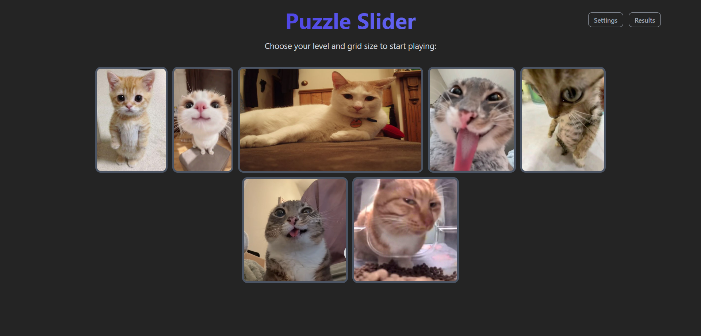
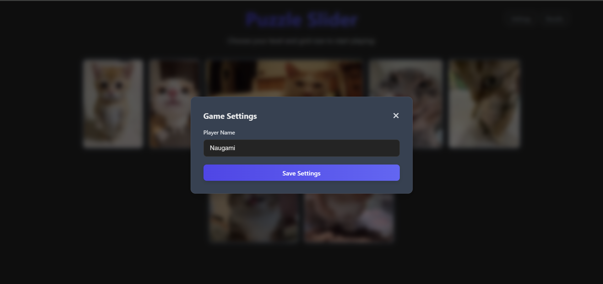
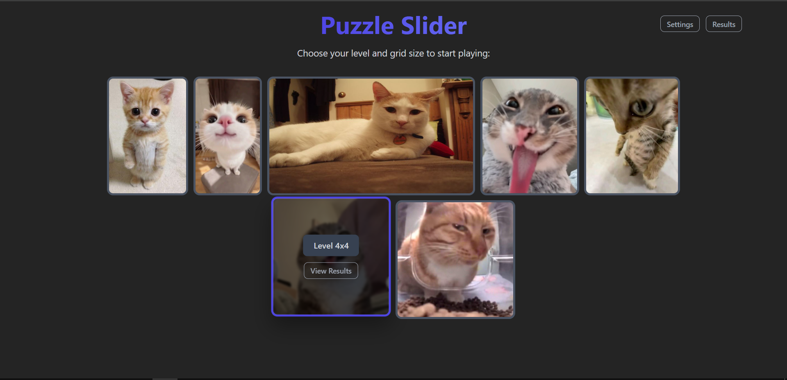
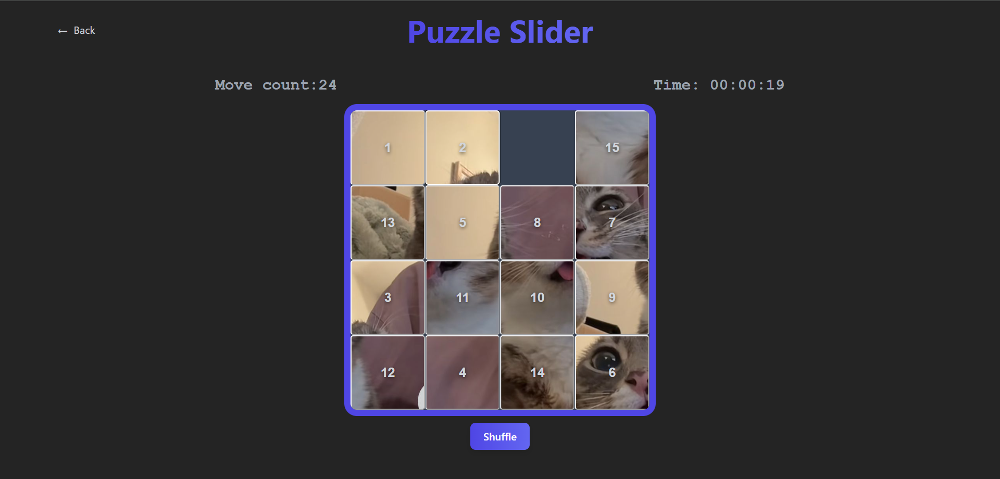
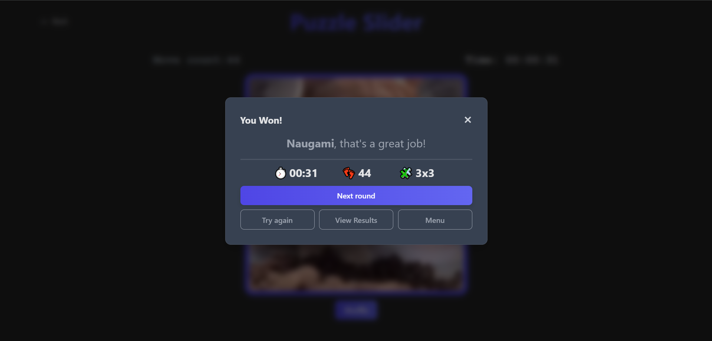
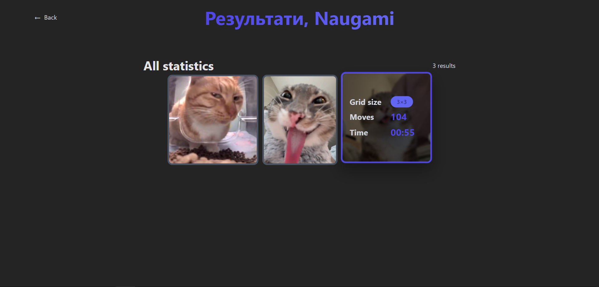
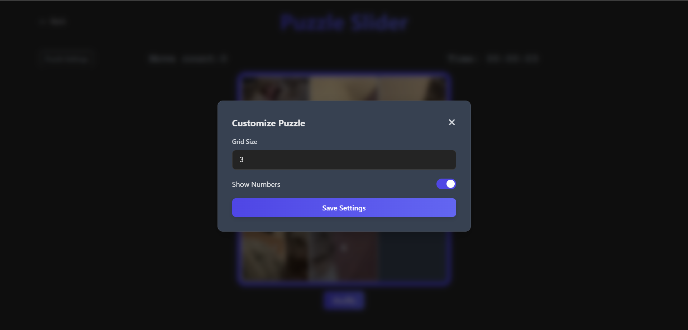

# 🧩 Puzzle Slider Game

Інтерактивна гра-головоломка, де потрібно розставити плитки з картинкою у правильному порядку. Проєкт побудований з використанням React, TypeScript та Feature-Sliced Design архітектури.

## 📸 Скриншоти









## ✨ Основні можливості

- 🎮 **Прогресивна система рівнів** — розпочни з простих пазлів 3×3 і дійди до складних 10×10
- 🏆 **Відстеження рекордів** — збережи свої найкращі результати для кожного розміру сітки
- 📊 **Детальна статистика** — відстежувати час та кількість ходів
- 🎨 **Різноманітні рівні** — унікальні картинки для кожного пазла
- 💾 **Збереження прогресу** — твій прогрес зберігається автоматично
- 📱 **Адаптивний дизайн** — грай на будь-якому пристрої

## 🛠️ Технології

- **React 19** — сучасна бібліотека для побудови UI
- **TypeScript** — типізація для надійності коду
- **Zustand** — легкий state management
- **React Router** — маршрутизація сторінок
- **React Hook Form** — управління формами
- **Vite** — швидкий bundler
- **CSS Modules** — ізольовані стилі

## 🏗️ Архітектура

Проєкт побудований за принципами **Feature-Sliced Design (FSD)**:

```
src/
├── app/                    # Ініціалізація додатку, роутинг, провайдери
│   ├── entrypoint/         # Точка входу React
│   ├── providers/          # Глобальні провайдери
│   ├── routes/             # Конфігурація роутингу
│   └── styles/             # Глобальні стилі
│
├── pages/                  # Сторінки додатку
│   ├── main/               # Головна сторінка з вибором рівнів
│   ├── game/               # Сторінка гри
│   └── result/             # Сторінка результатів
│
├── widgets/                # Композитні UI блоки
│   ├── puzzleBoard/        # Ігрове поле з плитками
│   ├── gameSession/        # Контейнер ігрової сесії
│   ├── header/             # Шапка додатку
│   ├── levelList/          # Список рівнів
│   └── resultsOverview/    # Огляд результатів
│
├── features/               # Бізнес-логіка та функціональність
│   ├── puzzleBoard/        # Логіка пазла (хуки, стор)
│   ├── levelProgress/      # Система прогресу рівнів
│   ├── configureGame/      # Налаштування гри
│   ├── gameWinModal/       # Модалка перемоги
│   ├── puzzleSettingForm/  # Форма налаштувань пазла
│   └── resultsHistory/     # Історія результатів
│
├── entities/               # Бізнес-сутності
│   ├── tile/               # Плитка пазла
│   ├── levelCard/          # Картка рівня
│   ├── gameSettings/       # Налаштування гри
│   └── gameStats/          # Статистика гри
│
└── shared/                 # Переповторювані компоненти та утиліти
    ├── ui/                 # UI компоненти (Button, Modal, Input...)
    ├── lib/                # Утиліти та хуки
    │   ├── hooks/          # useTimer, useImageLoader
    │   ├── model/          # formatTime
    │   └── puzzle/         # puzzleLogic, constants
    └── types/              # Спільні TypeScript типи
```

### Принципи FSD:
- **Односпрямовані залежності**: вищі шари імпортують з нижчих
- **Публічний API**: кожен модуль експортується через index.ts
- **Ізоляція**: компоненти не знають про реалізацію інших модулів

## 🚀 Швидкий старт

### Встановлення

```bash
# Клонування репозиторію
git clone <repository-url>

# Перехід до директорії проєкту
cd puzzle-slider

# Встановлення залежностей
npm install
```

### Запуск у режимі розробки

```bash
npm run dev
```

### Збірка для production

```bash
npm run build
```

### Перегляд production збірки

```bash
npm run preview
```

## 🎮 Як грати

1. **Введи своє ім'я** на головному екрані
2. **Обери рівень** зі списку доступних пазлів
3. **Клікай на плитки** поруч з порожнім місцем, щоб переміщати їх
4. **Склади повну картинку** якнайшвидше та з мінімальною кількістю ходів!

## 🎯 Система прогресу

- Почни з рівня **3×3**
- Пройди поточний розмір, щоб розблокувати **наступний**
- Досягни розміру **5×5**, щоб відкрити **пісочницю**

## 💾 Збереження даних

Прогрес гравців зберігається локально та включає:

- Поточний розблокований розмір для кожного рівня
- Найкращі результати (час та ходи) для кожного розміру
- Статус відкриття режиму пісочниці

---

Зроблено з ❤️, безсонних ночей та багатьма переміщеннями плиток